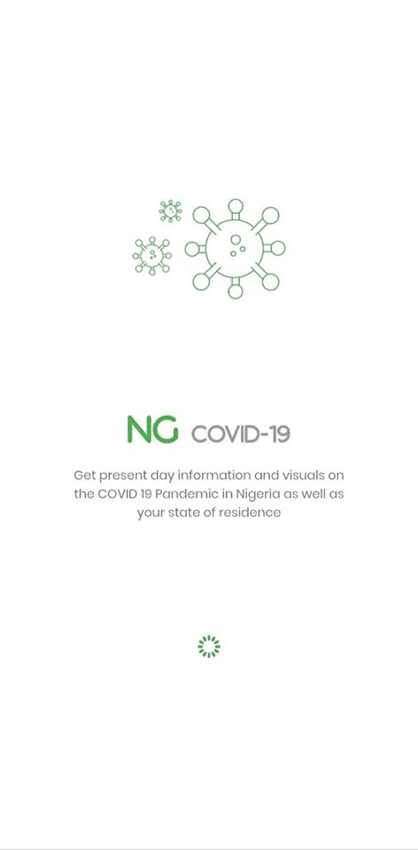
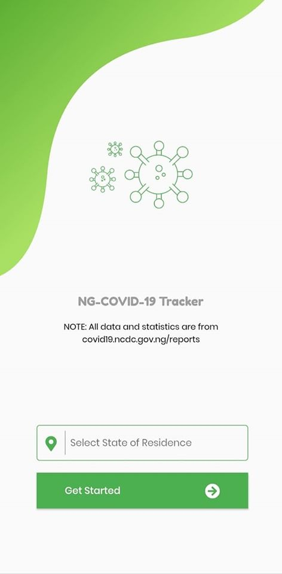
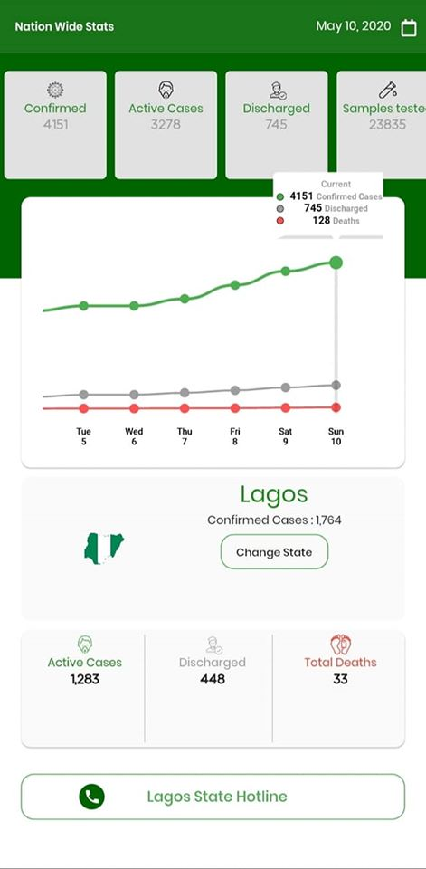

# NG COVID-19 Tracker v1.0.0

A Cross Platform Mobile Application for tracking the COVID-19 pandemic in Nigeria

>SCREEN SHOTS v1.0.0

<table><tr>
  <td style="text-align: center">
  
</td>
  <td style="text-align: center">
  
</td>
<td style="text-align: center">

</td>
 
</tr></table>

## Application Features

The Application contains the following features:

- NCDC Hotlines 
- Graphical visualization of Active Cases,Confirmed Cases,Total Samples Tested e.t.c
- Numeric representation of Active Cases,Confirmed Cases,Total Samples Tested e.t.c

## Download App

Click the [DOWNLOAD APP](https://bit.ly/3fuSeKB) to download the .apk version of the app.

